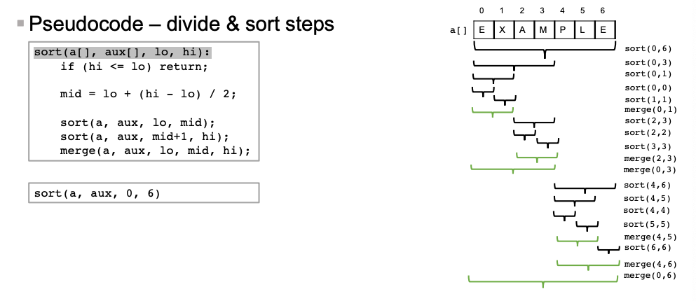
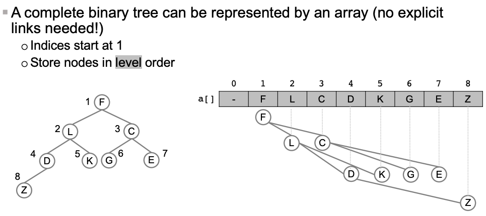
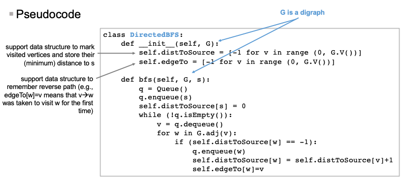
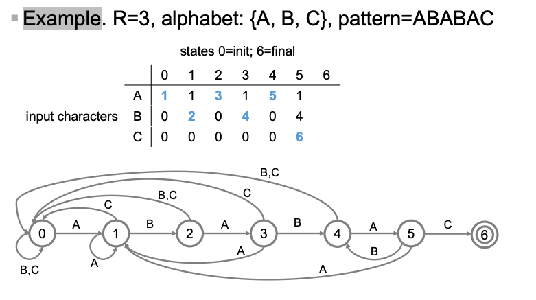
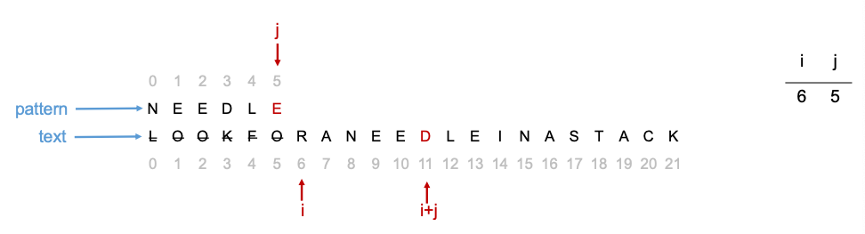

# Algorithms

## Union-Find

- Given a set of N objects
  - union: connect two objects (merge two set)
  - find: is there a path connecting the two objects (Check if in the same set)
    - 

- Step 1
  - Modelling the problem
    - Objects: integers [0,N-1]
    - Connected relation: equivalence relation
    - Connected components: maximal set of objects manually connected

- Step 2
  - Design data structures and algorithms for efficiently solve the problem

### Eager Approach (quick-find)

- 

```python
# init
id = []
for i in range(N):
    id.append(i)

# union
def union(u,v):
    uid = id[u]
    vid = id[v]
    for i in range(N):
        if id[i] == uid:
            id[i] = vid

# find
def find(u,v):
    return id[u] == id[v]
```

### Lazy Approach (quick union)

- Operations:
  - find(u,v). `root(u) == root(v)`
  - union(u,v). `set id of root(u) to the id of root(v)`

    ```python
        union(3,5):
            id[root(3)] = id[root(5)]
            id[9] = 6
    ```

    

```python
#root
def root(i):
    while i! = id[i]:
        i = id[i]
    return i

# union
def union(u,v):
    r_u = root(u)
    r_v = root(v)
    # Connect one root to the other
    id[r_u] = r_v
```

#### Cost analysis for union


### Weighted Quick-Union

- Modify Quick Union to *avoid tall trees*
  - Keep track of *size of each tree*
  - Union: link smaller tree tothe root of larger tree

    

```python
# init
id = []
size = []
for i in range(N):
    id.append(i)
    size.append(i)

# root
def root(i):
    while id[i] != i:
        i = id[i]
    return i

# find -> same
# union:
    def union(u,v):
        r_u = root[u]
        r_v = root[v]
        if r_u == r_v return 
        if size[r_u] < size[r_v]:
            id[r_u] = r_v
            size[r_v] += size[r_u]
        else:
            id[r_v] = r_u
            size[r_u] = size[r_v]
```


- Further improvement
  - root() bottle neck
  - Quick-Union with path *compression*

## Order of Growth

- Best case - lower bound on cost ($\Omega(N)$)
- Worst case - Upper bound ($O(N)$)
- Average case - Expected cost for random input ($\Theta(N)$)
- Approsimate model (with coefficient)
  - e.g. $\~{2N^2}$

## Abstract Data Types (ADTs)

- Linear
  - Stack
  - Queue
  - Set & Multiset
  - Map
  - Priority Queue
- Non-linear
  - Tree
  - Graph

### Stack

```python
# Keep the array size at 25% to 100% full anytime
push()
pop()
isEmpty()
```

### Queue

```python
enqueue(item)
dequeue()
```

### Set & MultiSet

- Set
  - unindexed, unordered, unrepeated

```python
insert(item)
remove(item)
contains(item)
```

- Multi-Set
  - unindexed, unordered, possibly duplicated element

```python
insert(item)
remove(item)
contains(item)
```

### Map

```python
insert(key, value)
remove(key)
update(key,value)
lookup(key)
```

### Priority Queue

```python
enqueue(item, priority)
dequeue()
```

## Array Sort

### Selection Sort

- Scan from left to right
- find the *min* in the array
- swap

```python
function selection_sort (arr)
    len = len(arr)
    for i in range 0,len-1:
        for j in range i, len:
            if (a[j] < a[min]) then min = j
        swap(a[i],a[min])     
```

- Complexity: $O(N^2)$

### Insertion Sort

- scan from left to right
- in iteration i, *swap a[i]* with each higher entry to its left
- 

  - Construct an ascending order on the left section



```python
function insertion_sort(arr):
    length = length arr
    for i in range(1, length):
        for j in range(i, 0, -1):
            if arr[j-1] > a[j]:
                swap a[j-1] a[j]
            else:
                break
```

- Complexity
  - N - N^2 (array in reverse order)

### Merge Sort


```python
sort(arr, aux, lo, hi):
    if (hi <= lo) return
    else:
        mid = lo + (hi - lo)//2
    
    sort(aux, a, lo, mid)
    sort(aux, a, mid+1, hi)
    merge(a, aux, lo, mid, hi)

merge(a, aux, lo, mid, hi):
    i = lo
    j = mid+1

    for k in range(lo, hi+1):
        # All left part is read
        if i > mid: a[k] = aux[j] ; j++ 
        # All right part is read
        if j > hi: a[k] = aux[i]; i++
        
        else if a[j] < a[i]: aux[k] = a[j] ; j++
        else: aux[k] = a[i]; i ++
    
```

#### Analysis

- Cost
  - Time $N\lg{N}$
  - Space $cN$

### Quick Sort

- Steps
  - Shuffle the array
  - Parition a[] so that, for some j
    - a[j] is in the array
    - a[i] <= a[j] for any i < j
    - a[i] >= a[j] for any i > j
  - Sort each partition *recursively*

- Partition step
  - Pivoting element a[lo]
  - Repead each step until i j crosses
    - i from left to right so long as a[i] < a[lo]
    - j from right to left so long as a[j] > a[j]
    - swap i, j 

```python
partition(a, lo, hi):
    i = lo
    j = hi + 1
    piv = a[lo]

    while(true):
        while a[++i] < a[lo]
            if i == hi: break
        while a[--j] > a[lo]
            if j ==lo: break

        if i >= j break
        else swap a[i] a[j] 
    swap a[lo] a[j]
    return j

sort(a, lo, hi):
    if hi <= lo:
        return 
    
    j = partition(a, lo, hi)
    sort(a, lo, j)
    sort(a, j+1, hi)
```

- Analysis
  - Average case: Number of compares: ~$N\lg{N}$
  - Worst case: number of compares: ~$\frac 12 N^2$ 

- Properties
  - QS is in-place
  - But not safe

### Heap Sort

- Binary Heap
  - 
  - Parent of node i is at `a[i/2]`
  - Children of node i are at `a[2i(or +1)]`

- Properties
  - Keys stored in nodes
  - A parent's key is larger than children
  - Highest priority at a[1]
  - a[0] is *empty*

#### Implementing PQ ADT Using Heap 

- Insertionin a heap
  - Add new node at end
  - If child > parent, swap and repeat until heap order is maintained

- Cost
  - At most $1+\lg{N}$

```python
enqueue(key):
    N = length of heap
    a[++N] = key
    swim(N)

swim(i):
    while (i > 1 && a[i//2] < a[i]):
        swap a[i//2] a[i]
        i = i // 2
```

- Dequeue from a heap
  - Swap the root with the node at the end
  - Remove the last
  - Sink the root down

```python
dequeue():
    max = a[1]
    swap a[1] a[N]
    a[N--] = None
    sink[1]
    return max

sink(i):
    while 2*i < N:
        j = 2*i

        if (j < N && a[j] < a[j+1]): j++ # make sure j at larger node 
        if (a[i] >= a[j]) break # i larger than both node
        
        swap a[i] a[j]
        i = j
```

- Analysis
  - at most $2\lg{N}$

#### Implementing Heap Sort

- Key idea
  - Create a max heap ordered array with all N keys
  - Keep dequeue the max key remaining

```python
sort():
    # Construct Heap
    for i in range(N//2, 0, -1):
        # Sink all parent node to maintain the tree
        sink(i) 
    
    while N > 1:
        swap(a[1], a[N--])
        sink(1)
```

- Analysis
  - Construction $O(N)$
  - HeapSort $O(N\lg{N})$

## Symbol Table

- ADT to handle *key-value types*
  - Associative array, dictionary or map

### Search in Sorted Array

- 

## Binary Tree

```python
class Node:
    def __init__(self, key, value):
        self.key = key
        self.value = value
        self.left = None
        self.right = None

    def get(self, key)
    def put(self, key, value)
```


## 2-3 Search Tree


- Case 1: Insert into 2 node
  - Convert to 3 node
- Case 2: Insert into a 3 node
  - Create *temporary 4 node*
  - Move the middle key into the parent node, the other 2 becomes *2-nodes children*
  - repeat if necessary

- *Performance*
  - Guaranteed Logorithm time

## LLRBBST

- Key idea: represent a 2-3 tree as a BST

### Operation on RBBST

- get(): exactly the same as BST (by ignoring the class)

```python
class Node:
    def __init__(self, key, value):
        self.key = key
        self.value = value
        self.left = None
        self.right = None
        # Use boolean attribute to represent colour of incoming ink
        # Null link are black
        self.colour = BLACK
    
    def get(self, key):
        if self.key == key:
            return self.value
        elif key < self.key and self.left:
            return self.left.get(key)
        elif key > self.key and self.right:
            return self.right.get(key)
        else:
            return None

    def __rotate_left(node):
        
        aux = node.right
        node.right = aux.left
        aux.left = node
        node.colour = RED
        
        return aux
    
    def __rotate_right(node):
        
        aux = node.left
        node.left = aux.right
        aux.right = node
        aux.colour = node.colour
        node.colout = RED

        return aux
    
    def __flip(node):
        node.colour = RED
        node.left.colour = BLACK
        node.right.colour = BLACK
        
    def put(node, key, value):
        if node == None:
            return Node(key, value, RED)
        
        # Traditional reverse traversal to find where to insert

        # Done inserting, maintain the tree
        if isRed(node.right) and (not isRed(node.left)) node = node.rotateLeft(node)
        if isRed(node.left) and isRed(node.left.left) node = rotateRight(node)
        if isred(node.left) and isRed(node.right) flipNode(node)

        return node

```

- Analysis
  - The height of tree is $\le 2 \lg {N}$

## Hashing

- Key idea: Use a *hash function* to transform *keys* to integers used as *indexes* in an array

### Hash Function

- Integer Keys: $|n| \mod M$
- Double keys x: Modular Hashing on the *binary representation of x*
- String: *treate as huge integer*

    ```python
    hash = 0
    for i in range (0, len(s)):
        hash = (R * hash + s[i]) % M # R is a small prime number
    ```

### Separate Chaining

- Data Structure: *array of M linked list*
- Operation
  - Hash
  - Insert
  - Search

-Example
    

```python
class SeparateChainingHashTable:
    class Node:
        def __init__ (self, key, value):
            self.key = key
            self.value = value
            self.next = None
            
    M = 97 # Number of Chains    
    hash_table = [Node(None, None) for i in range M]

    def hash(self, key):
        return key % M

    def get(self,key):
        i = self.hash(self,key)
        node = self.hash_table[i]

        while not node.key == key:
            if node.key == key: return x.value
            else: node = node.next
        return None
    
    def put(self, key, value):
        i = self.hash(key)
        node = self.hash_table[i]
        while not node == None:
            if node.key == key:
                node.value = value
                return
            else:
                node = node.next
        self.hash_table[i] = Node(key, value, hash_table[i])  
```

- Performance
  - *Proportional* to the number of *keys* in a chain
  - Under uniform hashing *assumption*, the probability that the number of keys in a chain is within a constant factor of *N/M* is close to 1

- How to choose M
  - M ~ N/5

### Linear Probing

- Key Idea
  - Put value at index if possible, if not try +1 repeatedly

```python
class LinearProbingHashTable:
    # Regulate the size of table
    M = N*2 + 1
    ht_keys = array of size M
    ht_values = array of size m

    def hash(self, key):
        return key % self.M
    
    def get(self, key):
        i = self.hash(key)
        while self.ht_keys[i]:
            if self.ht_keys[i] == key
                return self.ht_values[i]
            else: i = (i+1) % M 
        return None

    def put(self, key, value):
        i = self.hash(key)
        while self.ht_key[i]:
            if self.ht_key[i] == key
                self.ht_values[i] = values
            else:
                i = (i+1) % M
        self.ht_keys[i] = key
        self.ht_values[i] = value

```

### Performance Comparison


## Graph Overview

- Common Problems
  - Path existence
  - Shortest path
  - Cycle
  - Euler tour
  - Hamilton tour
  - Connectivity
  - *MST* (Minimum Spanning Tree)
  - Graph Isomorphism

## Undirected Graph

### Representing Graph

- API
  - 

- Implementation
  - Matrix

    
  
  - Adjacency list

    
  
    ```python
      class Graph:
          def __init__ (self, V):
            self.V = V
            self.adj = []
            for _ in range(0,V):
              self.adj.append(Bag()) 
            
          def V(self):
            return self.len(V)

          def edd_edge(self, v, w):
            self.adj[v].add(w)
            self.adj[w].add(v)
          
          def adj (self, v):
            return self.adj[v]
    ```

### Depth First Search

- Target
  - Find all v connected to vertex s

- Example
  - 

```python
class DFS:
  def __init__(self, G, s):
    self.marked = [False for v in range(0, G.V())]
    self.edgeTo = [-1 for v in range (0, G.V())]
    self.dfs (G,s)

  def dfs(self, G, v):
    self.marked[v] = true
    for w in G.adj[v]:
      if not self.marked[w]:
        self.dfs(G,w)
        # record all the possible paths
        self.edgeTo[w] = v
  
  def pathTo(self, v, s):
    if not self.hasPathTo(v): return None
    path = Stack()
    x = v
    while not x == s:
      path.push(x)
      x = self.edgeTo[x]
    path.push(s)
    return path
```

### Breadth First Search

- Put s onto a queue and mark s as visited
- repead until the queue is empty
  - Dequeue vertex v from the queue
  - Enquque all the *unvisited* adj vertices and mark visited
- Can track the distance while calculating

```python
class BFS:
  def __init__(self, G):
    self.distToSource = [-1 for v in range(0, G.V())]
    self.edgeTo = [-1 for v n range(0, G.V())]
  
  def bfs(self, G, s):
    q = Queue()
    q.enqueue(s)
    self.distToSource[s] = 0
    while not q.isEmpty():
      v = q.dequeue()
      for w in G.adj(v):
        if (self.distToSource[w] == -1):
          q.enqueue(w)
          self.distToSource[w] = self.distToSource[v] + 1
          self.edgeTo[w] = v

    def minPathLengthTo(self, v):
      return self.distToSource[v]

    def shortestPathTo (self, v, s):
      # same as PathTo
```

### Connected Component

- Target: Partition vertices into connected components
- How-to:
  - initialise all v as *unmarked*
  - For each unmarked vertex, run *DFS* to identify all vertices that *belong to the same connected component as v*

```python
class ConnectedComponent:
  def __init__(self, G):
    self.marked = [False for all vertex]
    self.cc = [-1 for all vertex]
    self.count = 0
    for each vertex v:
      if not self.marked[v]:
        self.dfs(G, v)
        self.count ++
    
  def dfs(self, G, v):
    self.marked[v] = true
    # cc -> which component will vertex v belong to 
    self.cc[v] = self.count
    for w in G.adj(v):
      if not self.marked[w]:
        self.dfs(G, w)
```

### Analysis - Undirected Graphs


## Directed Graph

- Only add single direction
  - 

### DFS

- Same as Undirected Graph, Except the graph is directed
  

### BFS

- Same as ...
  

### Topological Sort

- target, provide a *directed acyclic graph (DAG)*
  

- Method
  - Check if the graph is DAG
  - Run DFS
  - Return vertices in *reverse post order*


This provides a *reverse-topological-order*

### Is a Given DG a DAG?

- How to:
  - Visit G using DFS
  - Keep track of vertices whose recursive dfs() call *has not completed yet*
  - If call is made to a vertex with an *open dfs()*, not a DAG

```python
class DirectedCyle:
  def __init__(self, G):
    self.marked = [False for all vertex]
    self.onCallStack = [False for all vertex]
    self.cycleDetected
    for vertex in vertexes:
      if not self.marked[vertex]:
        self.dfs(G,v)

  def dfs(self, G, v):
    self.marked[v] = True
    # mark oncall stack
    self.onCallStack[v] = True
    for each adj edges to v:
      if self.cycleDetected return
      elif not self.marked[w]: self.dfs(G, w)
      elif self.onCallStack[w] self.cycleDetected = True
    self.onCallStack[v] = False
```

### Strong Connectivity

- Definition
  - v and w are *strongly connected* if there's both a directed path from *v to w* and a directed path from *w to v*
  - A *strong component* is a *maximal subset of strongly connected vertices*

- Property
  - Strong components in G are same as in *G_reverse*

- Two-phase approach
  - Compute Topological Order in *G_R* 
  - Run DFS in G, visiting unmarked vertices in revcerse post order of *G_R*


### Kosaraju-Sharir Algorithm

```python
class StronglyConnectedComponent:
  
  def __init__(self, G):
    self.marked = [False for all vertex]
    # id to identify if strong connected component
    self.scc = [-1 for all vertex]
    self.count = 0
    dfsOrder = DepthFirstOrder(G.reverse())
    # get reverse order stack
    reverseOrder = dfsOrder.reversePost()
    while not reverseOrder.isEmpty():
      v = reverseOrder.pop()
      if not self.marked[v]:
        # Run dfs on v
        self.dfs(G,v)
        self.count++
    
  def dfs(self, G, v):
      self.marked[v] = true
      self.scc[v] = self.count
      for w in G.adj(v):
        if not self.marked[w]:
          self.dfs(G,w)

  def sameSCC(self, v, w):
    return self.scc[v] == self.scc[w]
```


## Minimum Spanning Tree

- Target
  - Find the smallest connected and acyclic spanning tree that has the *smallest sum of weight*

### Greedy Algorithm

- Properties
  - *Cut* a partition of its vertices into two sets
  - Crossing edge connects a vertex in one set with a *vertex* in the other
  - Property: Given any cut, the crossing edge of *min* weight in the MST

- Key idea
  - Start with all edges coloured grey
  - Find a cut with no *black-crossing edges*
  - Color its min-weight edge black
  - Repeat until *V-1* edgeds are coloured black


- **Challenges**
  - **How to choose a cut?**
  - **How to identify the min-weighted edge in the cut**

### Kruskal's Algorithm

- Idea
  - Consider edges in ascending order of weight
  - Add the next edge to the MST unless this would create a cycle
    - Whether this creates a cycle?
      - Option1: run DFS(v) and check whether w is reachable
        - Cost $O(V)$
      - Option2: use *Union-Find* data structure and the *weighted* quick-union realization
        - To check whether v and w belong to the same connected component
          

  - Stop when all edges have considered


```python
class Edge:
  def __init__(self, v, w, weight):
    self.v = v
    self.w = w
    self.weight = weight
  
  def endPoint(self):
    return v
  
  def otherEndPoint(self):
    return w
  
  def compareTo(self, Edge, e):
    if self.weight < e.weight: return -1
    elif self.weight > e.weight: return 1
    else return 0

class EdgeWeightedGraph:
    def __init__(self, V):
      self.V = V
      self.adj = []
      for _ in range(0,V):
        self.adj.append(Bag())
      
    def addEdge(self,e):
      v = e.endPoint()
      w = e.otherEndPoint()
      self.adj[v].add(e)
      self.adj[w].add(e)
    
    def adj(self, v):
      return self.adj[v]

class KruskalMST:
  def __init__(EdgeWeightedGraph,G):
    self.mst = Queue()
    self.pq = MinPQ()
    # initialise the PQ
    for e in edges():
      self.pq.insert(e)
    
    uf = UF(G.V())
    # add edges to the mst
    while(!self.pq.isEmpty() and self.mst.size() < (G.V() - 1)):
      e = self.pq.delMin()
      v = e.endPoint()
      w = e.otherEndPoint()

      if not uf.connected(v,w):
        uf.union(v,w)
        self.mst.enqueue(e)
    
    def edges(self):
      return self.mst
```

- Analysis
  - $E \log{E}$ in the worst case
  - 

### Prim's Algorithm

- Key Idea:
  - Start with vertex 0 and greedily grow tree T
  - Add T to the min-weighted edge with *exactly one endpoint in T*
  - Stop when V-1 edges have been added

- How to find the min-weighted edge
  - Option 1: try all edges
  - Option 2: use priority queue containing all edges with at least one endpoint in T
    - *$O(\lg{E})$*
      
      - Add new edges to the pq when new nodes were added

```python
class LazyPrimMST:
  def __init__(self, G):
    self.marked = [False for all vertex]
    self.mst = Queue()
    self.pq = MinPQ()
    visit(G,0)

    while (not self.pq.isEmpty()) and self.mst.size() < G.V()-1:
      e = self.pq.delMin()
      v = e.endPoint()
      w = e.otherEndPoint() 
      if self.marked[e] and self.marked[w]: skip
      else:
        self.mst.enqueue(e)
        if not self.marked[v] visit(G,v)
        if not self.marked[w] visit(G,w)

  def visit(self, v):
    self.marked[v] = True
    for all e in G.adj(v):
      if not self.marked[e.otherEndPoint(v)]:
        # add all unmarked vertex connected to v
        self.pq.insert(e)
  
  def edges(self):
    return self.mst
```

- Cost
  - $E\log{E}$

## Shortest Path

- Reresentation of **Edge-weighted** graph


```python
class DirectedEdge:
  def__init__(self, v, w, weight):
    self.v = v
    self.w = w
    self.weight = weight

  def from(self):
    return self.v
  
  def to(self):
    return self.w
  
  def weight(self):
    return self.weight
  
class EdgeWeightedDigraph:
  def __init__(self, V):
    self.V = V
    self.adj = []
    for all vertex:
      self.adj.append(Bag())
  
  def addEdge(self,e):
    v = e.from()
    self.adj[v].add(e)
  
  def adj(self,v):
    return self.adj[v]
```

### Shortest Path API

```python
class ShortestPath:
  def __init__(self, G, s)
  # The distance from s to v
  def distTo(self, v):
    return self.distTo(v)
  # The last edge on the shortest path from s to v
  def pathTo(self, v):
    path = Stack()
    e = edgeTo[v]
    while e not empty:
      path.push(e)
      # get next edge
      e = self.edgeTo[e.from()]
    return path
```


- **Relaxation**
  - `distTo[v]` is the length of the shortest *known path from s to v*
  - `distTo[w]` is the length of the shortest *known path from s to w*
  - `edgeTo[w]` is the last edge on the *shortest know path* from s to w
  - Edge Relaxation `e = v -> w`
    - If `e = v->w` gives a shortest path to w through v than what known so far, updata both *distTo[w]* and *edgeTo[w]* to use e
  
  

- *Generic Algorithm* to compute Shortest Path
  - Initialise *distTo[s] = 0*
  - Initialise *distTo[v] = Infty* for all other vertices
  - Repeak relax(e) for any edge e: *v->w*, untial no more edges e for which `distTo[v] + e.weight() < distTo(w)`

- How to choose which edge to relax next
  - Dijkstra's Algorith (*Assume non-negative weights*)
  - Edge-weighted DAG Algorithm (*Assume DAG*)
  - Bellman-Ford Algorithm (*Generic*) 

### Dijkstra's Algorithm

- Assumption
  - *No negative weights*

- Key idea:
  - Consider vertices in increasing order of distace from s
  - Add vertex to SPT and relax all its outgoing edges
    
    
    

```python
class DijkstraSP:
  def __init__(self, G, s):
    self.edgeTo = [None for all vertex]
    self.distTo = [INFTY for all vertex]
    self.distTo[s] = 0

    # Min-indexed pq, based on the dis to s
    self.pq = MinPQ()
    self.pq.insert(s,0)

    while not self.pq.isEmpty():
      v = self.pq.delMin()
      for edge e in self.adj(v):
        self.relax(e)
  
  def relax(self, e):
    v = e.from()
    w = e.to()

    if self.distTo[w] > self.distTo[v] + e.weight():
      self.distTo[w] = self.distTo[w] + e.weight()
      self.edgeTo[w] = e
      if self.pq.contains(w):
        # update w in the pq
        self.pq.decreaseKey(w, self.distTo[w])
      else:
        self.pq.insert(w, self.distTo[w])
```

- Cost
  - 

### Edge-Weighted DAG Algorithm

- Assumption
  - The graph is DAG

- Key idea
  - Consider vertices in *topological order*
  - Add vertex to the Sortest Path Tree and relax all its outgoing edges

```python
class AcyclicSP:
  def __init__(self, G, s):
    self.edgeTo = [None for all vertex]
    self.distTo = [INFTY for all vertex]
    self.distTo[s] = 0

    dforder = DepthFirstOrder(G)
    topological = dforder.reverse()
    
    while not topological.isEmpty():
      v = topological.pop()
      for all e adj to v:
        self.relax(e)

  def relax(self, e):
    v = e.from()
    w = e.to()
    if self.distTo[w] > self.distTo[v] + e.weight():
      distTo[w] = self.distTo[v] + e.weight()
      self.edgeTo[w] = e
      # No priority queue in this algorithm
```

### Bellman-Ford Algorithm

- Deal with Negative weights
  - Negative cycle *is a directed cycle* where the sum of weights is *negative*
  - A shortest path tree *does not exist* if the digraph has *negative cycles*

- Assumptions: DG has no negetive cycles

- Key idea: repeat v times, relax all edges

```python
distTo = [INFTY for all vertex]
distTo[s] = 0

for i in range(0,G.V()):
  for v in range(0,V()):
    for e in G.adj(v):
      relax(e)
```

- Cost: $O = V\times E$

- Possible Improvement:
  - If distTo[v] does not change during pass i, no need to relax any outgoing edge from v in pass i+1
  - maintain a queue of vertices whose distTo[] changed
  - Cost: didn't change but only in worst case

### Summary'


## String Algorithm

### String

- Seq of Characters
- Character: Digit from a fixed alphebet of size R (*radix*)

#### String operations

- Length: Number of char
- Indexing
- Substring extraction
- String concatenation

## String Sorting Algorithms

### Key Index Counting

- Step
  - Count freq of each value in R using key as index
  - Compute frequency cumulates
  - Access cumulates using key as index and move items
  - Copy back

- Demo
  - 
    - 
    - Step 2: Compute the frequencies
    - Step 3: Access cumulates using the key as index, and move items

```python
N = len(a)
count = [0 for _ in range(R+1)]

#Step 1 Count frequency
for i in range(0,N):
    count[a[i] + 1]++

#Step 2 Cumulate the frequencies - So that the space between to key exactly fits the number in the previous key
for r in range (0,R):
    count[r+1] = count[r] + count[r+1]

# Step 3
for i in range(0,N):
    aux[count[a[i]]] = a[i]
    count[a[i]]++

# Step 4 Copy Array
for i in range(0,N):
    a[i] = aux[i]
```

#### Analysis - Key Indexed Counting

- Time: N+R
- Space: ~N+R
- Stable

### LSD Radix (Least-Significant-Digit First) Sort

- Assumption
  - Keys all have the same length D (small)
- Idea
  - Consider each character in turn, from right to left
  - Each pass, use the *key-indexed counting* on dth character to sort (*stably*)

```python
"""
a -> String Array
W -> fixed length strings (key)
"""
def LSDsort(a,W):
    N = len(a)
    for d in range(W-1, 0, -1):
        count = [0 for _ in range (R-1)]
        key_indexed_sort(count,W[][3])   
```

- Cost:
  - W(*Length of key*)*(N+R) -> O(N)
  - Space (N+R) -> O(N)

### MSD Radix (Most Significant Digit First) Sorting

- Idea:
  - Partition input into R pieces according to first character
  - Recursively sort all strings that start with the same character
  - *key-indexed counts delineate sub-partitions to sort*

- Example
  - 

#### Implementation

```python
def MSDsort(a,aux,lo,hi,d):
    if (hi <= lo) return
    # R+2 to cater for end-of-string-char
    count = [0 for _ in range(R+2)]

    # Steps in key-indexed counting, performed on each subpartition
    # Count Frequency
    for i in range(lo,hi):
        count[a[i][d]+2]++
    # Cumulate the frequency
    for r in range(0,R+1):
        count[r+1] = count[r+1] + count[r]
    # move to aux
    for i in range(lo,hi):
        aux[count[a[i][d]+1]] = a[i]
        count[a[i][d]+1]++
    # Copy
    for i in range(lo,hi)
        a[i] = aux[i-lo]

    # Recursively sort in each partition & move to right
    for r in range(0,R):
        sort(a, aux, lo+count[r], lo+count[r+1] - 1, d+1)
```

#### MSD Analysis

- 

### String Searching Algorithm

- Symbol Table: Abstract Data Type to handle *Key-Value pairs*
- Basic API:
  - `put(key -> String,value)`
  - `get(key -> Sting)`
  - `delete(key -> String)`

- Implementations
  - LLRB BST
  - Hash table
  

#### R-way Tries

(The number of node depend on the number of possible characters)

- Key idea
  - *Tree representation* of symbol table
    - Each node represents *one character*, not full keys
    - Each node has exactly *R children*, *one for each character*
    

  - Search:
    - follow links corresponding to each character in the *key*
    - return the value when *hit **ends** on a node with non-null value*
    - *miss ends* on a null-value node or reaches a null link: *return null*

  - Insert: follow links corresponding to each other in the key
    - *Encounter null link*: **new node**
    - *Encounter last character in the key*: set/update the value in the node

#### Representation of R-Way Tries node

- A key consists of <Value, Character-indexed array of *links* to R children>
- 

#### R-Way Tries Implementation

```python
class TrieST:

    class Node:
        def __init__(self):
            self.value = None
            self.children = [None for _ in range(0,R)]
    
    def __init__(self):
        self.root = Node()
    
    def put(self, key, value):
        self.root = __put(self.root,key,value,0)
    
    def __put(self, node, key, value, d):
        # If enter null node
        if(node == None):
            node = Node()

        # If reach end, assign value and return node to the last call 
        if(d == len(key)):
            node.value = value
            return node
        
        c = key[d]
        # Run recursively on the next node (tail recursion)
        node.children[c] = __put(node.children[c], key, value, d+1)
    
    def get(self,key):
        node = __get(self.root, key, 0)
        if (Node == None):
            return None
        else:
            # To avoid error
            return node.value

    def __get(self, node, key, d):
        if (node == None):
            return None
        if (d == len(key)):
            return node
        
        c = key[d]
        return __get(node.children[c], key, d+1)
```

#### R-Way Tries Analysis

- Time
  - Search Hit: Need to examine all *L* characters in the input key string
  - Search Miss: On average, only the length of substring of L (*sublinear in L*)

- Space
  - R null links at each leaf
  - Potentially many null links in *intermediate nodes* if strings do not *share prefixes*

- Overall: fast search, wastes space (*especially large R*)

#### 3 Way Tries

- Key Idea
  - Each node represents one character, *not full key*
  - Each node has **exactly 3 children**, *smaller, equal, larger*
  

- Search: follow link based on current key's character
  - Hits: return the value
  - Miss ends or reaches a null link: return null

#### 3-W-T Representation

- A 3WT node consists of:
  - a character c
  - a value
  - links to the left, mid, right node

#### 3WT Implementation

```python
class TenarySearchTrieST:
    class Node:
        def __init__(self):
            self.valuel = None
            self.char = ""
            self.left = None
            self.mid = None
            self.right = None

    def __init__(self):
        self.root = Node()
    
    def put(self, key, value):
        self.root = __put(self.root, key, value, 0)
    
    def __put(self, node, key, value, d):
        c = key[d]
        if (node == None):
            node = Node()
            node.char = c
        
        if (c < node.char):
            node.left = __put(self.left, key, value, d)
        elif (c > node.char):
            node.right = __put(self.right, key, value, d)
        elif (d < len(key)-1):
            # Found node for d, move one step forward to the next char
            node.mid = __put(self.mid, key, value, d+1)
        else:
            # Found the right place
            node.value = value
        return node
    
    def get(self, key):
        node = __get(root, key, 0)
        return None if node == None else node.value
    
    def __get(self, key, d):
        if (node == None):
            return Node
        
        c = key[d]
        if (c < node.char):
            return __get(node.left, key, d)
        elif (c > node.char):
            return __get(node.right, key, d)
        elif (d < len(key) - 1):
            return __get(node.mid, key, d+1)
        else:
            return node
```

#### 3WT analysis

- Space Links ~4*N (space efficient)
- Time: As fast as *hashing*, faster on *search miss*
- Extended API: *more flexible than either hashing or red-black BST*

### Extended API

- Prefix Match: find all keys in a symbol table starting with a *given prefix* 
  - Example: text matching (search engine)

- Longest prefix: find the longest key in the symbol table *that is the prefix of a given query string*

- Symbol Table Basic API:
  - `put(key,value)`
  - `get(key)`
  - `delete(key)`
- Extended API
  - `keysWithPrefix(s)`
  - `longestPrefixOf(s)`
  - `keys`

#### `keys()`

- iterate throught all keys in sorted order
  - How:
    - An in-order traversal of the trie
    - Keep track of matched characters on the path from *root to current node*
    - Add *matched keys to a queue*

#### Implementation of `keys()`

```python
#In R-Way Trie
def keys():
    queue = Queue()
    __collect(self,root, "", queue) 
    return queue

def __collect(node, prefix, queue):
    if (node == None):
        return
    
    if (node.value != None):
        queue.enqueue(prefix)
    
    for c in range(0,R):
        __collect(node.children[c], prefix+c, queue)
```

#### Implementation of `keysWithPrefix(s)`

```python
# Serch to the node, then use above method to find all possibilities
def keysWithPrefix(s):
    queue = Queue()
    x = __get(self.root, s, 0)
    __collect(x, s, queue)
    return queue
```

#### Implementation of `longestPrefixOf(s)`

- Examples
  - 

```python
"""
Find the longest key in the symbol that is prefix of s
1. Search for query string s
2. Keep track of the longest key encountered
"""
def longestPrefixOf(s):
    length = __search(self.root,s,0,0)
    return s.substring(0,length)

def __search(node, query, d, length):
    if (node == Node):
        return length
    if (node.value != None):
        length = d
    if (d == len(query)):
        return length
    c = query[d]
    return __search(node.children[c], query, d+1, length)

```

## SubString Search

- Find a pattern M in a text of length N (where *M << N*)
  - 
- Application
  - Doc processing
  - Spam filter
  - Electronic Surveilance
  - Web Scraping

### Brute Force

- Idea, use two indices i and j to scan the text and the pattern respectively
  - Compier jth character in the pattern with the (i+j)th character in the text
  - 

#### Sub-String Sorting Brute Force

```python
def subStringSearch(pattern, text):
    M = len(pattern)
    N = len(text)

    for i in range(0, N-M):
        for j in range(M):
            if text[i+j] != pattern[j]:
                break
        if j == M-1:
            return i
    # Not found
    return N 
```

- Cost: *(worst case)* ~N*M

### Knuth-Morris-Pratt Algorithm

- Brute Force: does not take advantage of characters already seen from the input stream
- Knuth-Morris-Pratt Algorithm
  - Avoids *backing up* by means of a *deterministic finite state automation* (DFA)

- ***Key idea***: Using a **DFA** as a searching machine
  - start in the initial state
  - read on char at a time from the input stream
  - consult the DFA transition table to know *what state to go next*
  - pattern found if leads to final state

- Example
  - 

#### Implementation of DFA in String Searching

- Main method

```python
def subStringSearch(text):
    N = len(text)
    j = 0
    i = 0
    while i < N and j < M:
        j = DFA[text[i][j]]
        i += 1
    if (j == M):
        return i - M
    else:
        return -1
```

- DFA
  - Init: create one state per character in the pattern, plus a final state
  - *Match transition*: `If in state j and next char c == pattern[j], go to state j+1`
  - Mismatch transition
    - If in state *j* and next `char c != pattern[j]`, then the last j-1 characters in input are `pattern[1..j-1], followed by c`
    - To fill in `DFA[c][j]`, simulate having pattern `[1..j-1]` in input to the DFA then take transition c
      - Example
        - 
        - 
        - 
        - 
        - 
        - 

- Implementation

```python
def KMP(pattern):
    M = len(pattern)
    R = size of possible char
    DFA = [[-1 for j in range [0,M]] for i in range[0,R]]

    # The first input
    DFA[pattern[0]][0] = 1
    X = 0

    for j in range(1,M):
        for c in range(0,R):
            DFA[c][j] = DFA[c][X]
        
        # on correct input, move to next state
        DFA[pattern[j]][j] = j+1
        X = DFA[pattern[j]][X]
```

#### Analysis of KMP

- Cost
  - Construction of DFA ~R*M
  - Substring search ~ M+N

### Boyer-Moore algorithm

- Scan pattern from right to left
- upon character mismatch, skip as many as M text characters
- *Dynamic Programming*

#### How much to skip

- Case 1: mismatched character(text[i+j]) not present in pattern, Move i beyond the mismatched position
  - (i -> i + j + 1)

- Case 2: mismatched character in the pattern
  - Precompute index of the right most occurrencce of *mismatched character in pattern, skip i forward*
  - 
  - 

```python
# marking the position on the string
for c in range(0,R):
    index[c] = -1

for j in range(0,M):
    index[pattern[j]] = j
```

- 

#### Implementation of BM Algorithm

```python
def subStringSearch(pattern,text):
    N = len(text)
    M = len(pattern)
    i = 0
    while (i <= N-M):
        skip = 0
        j = M-1
        while(j >= 0):
            # mismatch
            if(pattern[j] != text[i+j]):
                # refer to index table for how much to skip 
                skip = max(1, j-index[text[i+j]])
                break
            else:
                # match, check left
                j = j-1
            
        # if mismatch, then move right with provided skip
        i = i + skip
        # pattern found
        if (skip == 0):
            return i
    # Not found
    return N 
```

#### Analysis of BM algorithm

- Pre-processing ~M
- Substring matching
  - Average case ~N/M
  - Worst case ~M*N

### Lossless Compression

- Goal
  - Message: Given in input binary data B
  - Compress: Generate a "Compressed" representation C(B)
  - Expand: Reconstruct the original B without loss

- Compress ratio = $\text{bits in C(B)} / \text{bits in B}$

- Example
  - Lossless
    - Files
    - Archivers
    - File Systems
  - Lossy Compression
    - Images
    - Sound
    - Video
    - Communication

#### Run-length Coding

- Binary Input / Output
  - API to read / write bits

```python
class BinaryStdIn:
    readBoolean() -> boolean
    readChar() -> char # read 8 bits of data
    readChar(int r) -> char # read r bits of data

class BinaryStdOut:
    write(boolean b) # write the specified bit b
    write(char c) # write the specified 8-bit char
    write(char c, int r) # write the r least significant bits of the char 

```

#### Key Idea

- Use counts to represent sequences of 0/1bits
  - 

```python
class RunLength:
    def compress():
        count = 0
        # assume the seq start with 0
        previous = false

        while (!BinaryStdIn.isEmpty()):
            # read 1 bit
            bit = BinaryStdIn.readBoolean()
            # If same, accumulate the count
            if (bit == previous):
                count ++
            else:
                # Write count in 8 bits (what if exceeds?), reset accumulator
                BinaryStdOut.write(count, 8)
                count = 0
                previous = !previous
            
        # end the final loop
        BinaryStdOut.write(count)
    
    def expand():
        # Assume the seq starts with 0
        bit = false

        while (!BinaryStdIn.isEmpty()):
            count = BinaryStdIn.readChar()
            for i in range(0, count):
                BinaryStdOut.write(bit)
            # flip 
            bit = !bit
```

### Huffman Compression

- Key Idea
  - Instead of encoding every char in the alphabet
  - Use fewer bits for char that appear more often to lower the total number of bits
  - Example
    - 

- Modification
  - Use fixed length code
  - Append special stop-char after each codeword
  - **Generate prefix-free code**

#### Huffman Encoding

- Given input message B, Huffman encoding determine the *variable length prefix-free codewords* for B that use the minimum number of bits

- How
  - prefix-free codes represented as *binary trie*
  - Expansion based on *root-to-leaves* tries traversal of *bitstream*
  - Compression based on
    - *Trie Construction*
    - *Trie Transmission*
    - *Compression based on leaves-to-root-traversal*

- Representation

    

#### Implementation for Huffman Trie Node

```python
class Node:
    def __init__(self,ch,freq,left,right):
        self.ch = ch
        self.freq = freq
        self.left = left
        self.right = right
    
    def isLeaf (self):
        return (self.left == None and self.right == None)
    
    def compareTo(self, otherNode):
        return self.freq - otherNode.freq
```

#### Expand Huffman tree

- How to expande:
  - Upon receiving bit-stream *C(B)*, reconstruct the original message
    - start at the root of the trie and *read one bit from the input stream at a time*
    - **Go left if bit is 0, go right if 1**
    - Once a leaf, emit corresponding key and restart at the root

```python
    def expand():
        root = readTrie()
        # received bit stream, use it to find the char in the tree
        N = BinaryStdIn.readInt()

        for i in range(0,N):
            x = root
            while(! x.isLeaf()):
                # if read 0
                if (!BinaryStdIn.readBoolean()):
                    x = x.left
                # read 1
                else:
                    x = x.right
            # at leaf
            BinaryStdOut.write(x.ch, 8)
```

- Cost ~N

#### Compress Tree

- Tree construction
  - Length of encoding proportional to char freq in B

- Huffman algorithm:
  - Count freq[i] for each char i in the input
  - create a node for each *i* and assign weight = *freq[i]*
  - repeat until a single tree is formed
    - select the two tries with *minimum weights freq[i]* and *freq[j]*
    - merge into a single tree with *weight = freq[i] + freq[j]*

- Steps (Merge the root with *smallest freq each time*)


#### Implementation of Trie Construction

```python
def buildTrie():
    # using priority queue (priority = freq)
    pq = new MinPQ()
    # initialisation: one singleton trie created for each char in the message
    for i in range(0,R):
        if (freq[i] > 0):
            # new node with no left and right node
            newNode = Node(i, freq[i], null, null)
            # insert into the priority queue
            pq.insert(newNode)

    while (pq.size() > 1):
        x = pq.deleteMin()
        y = pq.delMin()
        parent = Node('', x.freq + y.freq, x, y)
        pq.insert(parent)

    # return the merged trie
    return pq.delMin()
```

#### Tree Transmission

- Writing
  - Pre-order traversal of the tree
  - For each internal node, emit 0
  - For each leaf node, emit 1 followed by corresponding char

```python
def writeTrie(node):
    # reached root
    if(node.isLeaf()):
        BinaryStdOut.write(true)
        BinaryStdOut.write(node.ch,8)
        return
    
    BinaryStdOut.write(false)
    writeTrie(node.left)
    writeTrie(node.right)

def readTrie():
    if (BinaryStdIn.readBoolean()):
        c = BinaryStdIn.readChar(8)
        return Node(c,0,null,null)
    
    x = readTrie()
    y = readTrie()
    return Node('', 0, x, y)
```

- Example


#### Build an encoding table and compress

```python
def buildCodeTable(root):
    codeTable = ["" for _ in range(0,R)]
    buildCodeTable(codeTable, root, "")
    return codeTable

def buildCodeTable(table, node, bitstr):
    # if reach root, add the bit string to the table
    if (node.isLeaf()):
        table[node.ch] = bitstr
        return
    
    buildCodeTable(table, node.left, bitstr + "0")
    buildCodeTable(table, node.right, bitstr + "1")

#Compress the Text
def compress(text):
    for i in range(0, len(text)):
        # find the correspondig binary codeword 
        codeword = codeTable[text[i]]
        for j in range(0, len(codeword)):
            if (code[j] == "1"):
                BinaryStdOut.write(true)
            else:
                BinaryStdOut.write(false)
```

#### Analysis of Huffman

- Steps
  - Trie construction
  - Trie transmission
  - Build an encoding table and use it(lookup) to compress

- Realisation: 2 paths
  - Path 1: compute char freq and build trie
  - Path 2: encode file via table lookup

Cost $~ N + R\lg{R}$