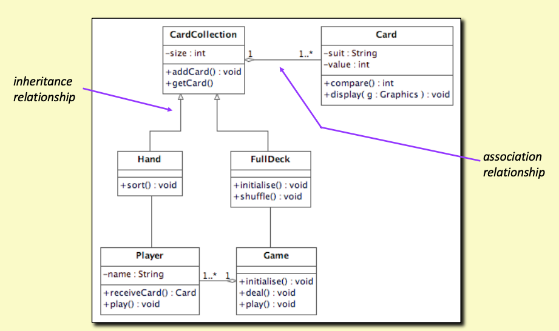
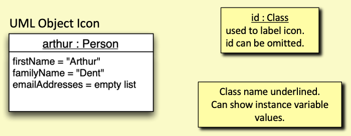
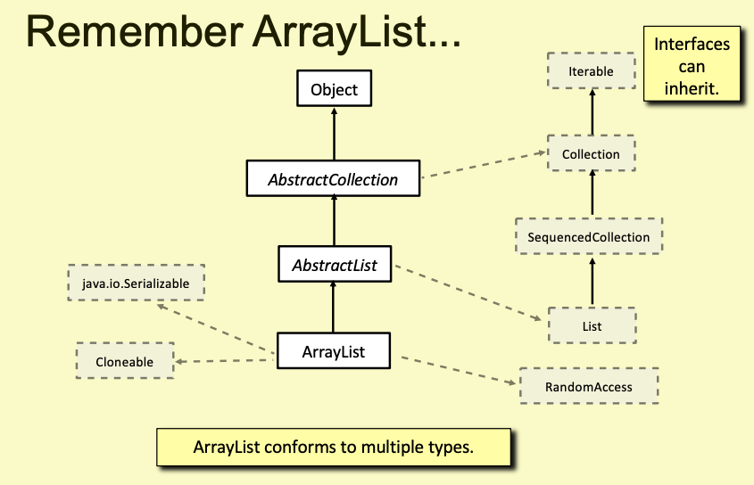

# Object Oriented Programming

## Main focuses

- Java Programming
- Software dev lifecycle
- Using language, tools and code lib
  - Git, IDE, API, Framework
- Providing UI
- Cloud

## Intro to Java

### Java v. C

- Jave is *OOed*, while C has no direct support for this
- Java has extensive *class libs*
  - For *GUIs, networking, dbs, graphics etc.*
- **JVM**
  - No direct access to memory or hardware
  - No pointers to the memory addresses
- A C Program: *a collection of C functions*
- A Java Program: *a collection of classes that define instance methods*
  - More advanced abstraction mechanisms

### Syntax

- Semi-colon: *a statement terminater*

### Terminal operation

- To compiler: `javac [fileName].java` -> creates a `.class` file
- To run: `java [fileName]`
  - Java interpreter actually runs the program

### Class

- A template that describes what a object **is and does**
  - by writing its def in the src
    - vars and methods
  - Organise and structure the code
  - Partitions and modularises the design
  - **A Class represents and abstraction**

### Objects

- Exist at *runtime*
- **responsibilities**
  - have *behaviour* -> *methods*
  - have *attributes* -> *instance vars* (A.K.A. proterties)
- An OO program is a collection of *communicating objects*

### Print(Stream)

```java
    System.out.println("Hello World");
```

- `System.out`: a *PrintStream* object **always avail** during runtime
- Java also supports `printf`
  - `System.out.printf("i = %d", x);`

### Java Normally Large, Why?

- Manages scale better
- Better code analysis
- Good IDE Support
- Very good debugging tool
- *Readability and Maintainability*
- *Consistency*

### Shorter?

```shell
-> ~ jshell
jshell> System.out,println("Hello World");
Hello world
```

### Possible implementation for shorter expression

```java
void main(){
    System.out.println("Hello World");
}
```

- To compile

```shell
javac --source 21 --enable-preview HelloWorld.java
java --source 21 --enable-preview HelloWorld
```

## JVM

### Java Compiler

- translates src into *bytecode*
  - Parsing, Analysis, Type Checking etc. is done
  - Bytecode is generated (**NOT MACHINECODE!!!**)
    - Just an equivalent representation of src
    - No bytecode analysis or optimisation
  - Compiler copiles each *src file* -> *`.class` file*
  - **No linking is done!!**, just produced a collection of `.class` file

### Java Virtual Machine

- an interpreter that runs bytecode
- but *not acting like a processor*
  - The interpreter provides a *complex highly structured environment*, based on **stack**
  - Bytecode can be translated *at runtime into actual machine code* to improve performance
    - Done incrementally when **sections of code are used frequently enough**

### Linking

- All linking is done at runtime *unlike C (during compiling process)*
- No single *executables*, only `.class` files
- `.class` files are loaded and linked by **JVM** as needed
  - all **language rules** are enforced through *extensive verification*
- Gives very *dynamic behaviour* with full type safety
  - But Java is **NOT A DYNAMIC LANGUAGE** (Python does)
  - mostly *statically typed*

### Bytecode & Machinecode

- Bytecode
  - an intermediate representation of *src*
  - frequently used in VM
- Machine code
  - lowest level of programming language
  - consists of **binary digits**
  - translated from code by *interpreters or compilers(e.g. gcc)*

## Core of Java

### Java Types

- Java is **STRONGLY TYPED**
- Type of everthing **MUST be declared**
  - (in the latest version of Java, type inference is supported though)
  - Compiler does a *type checking*
  - some dynamic checking is needed at *runtime*
- **Two Catagories**
  - Primitive types: `int, float, double, char etc.`
    - Like C
    - Values store directly
  - Class types: `String, ArrayList, Graphics etc.`
    - Values stored in this type are **references** to the objects on the *heap*
  
### Declaration v. Definition

- Similar to C, but more sophisticated
- But programmers tend to just use **DECLARATION** to cover both declaration and definition

### Variables

- Local, instance and parameter variables
  - Must *always* be *declared* before use
  - with an *explicit type*

### Primitive types and Values (Same on all machines unlike C)

- Boolean
- int - 32bits 2's complement integer (i.e. signed integer)
- long - 64bits 2's complement integer
- char - 16bit unsigned Unicode char
- float - 32bit floating point
- double - 64bit floating point

### Objects and References

- All objects are accessed via object **references**
- Objects exist on *heap memory* only
  - similar to C dynamic memory allocation
  - but **garbage collection** automatically frees memory

```java
MyClass myVariable = new MyClass
```

- Created and initialised an object, myVariable is the *reference* to the object

### Type Checking Rules

- Done at compile time for all *local, parameter and instance variable used*
- types must match or **convertible without loss of info**
  - `int a = 10.1 //ERROR! lost decimal placees`
  - `double d = 1.23D`, D can be omitted
  - `float f = 1.234 //ERROR`, 1.234 is double by default, use 1.234F to represent float
  - `boolean f = 0 //ERROR`, can only be true of false

### Type inference

```java
var x = 100*2; // int
var d = 1.90; // double
```

### Operators

- Same rules as C

### `==`

- Compares object *referencese* for class types
- `"abc" == "def"` compares their references to the String object
  - use `String.equals("string1")` instead

### Switch

- Pattern Matching

```java
Object obj = "Hello"
switch(obj){
    case String s -> System.out.println("String " + s);
    case Integer i -> ...;
    default -> break;
}
```

### Scope and Lifetime

- Scope
  - Region of a program where a variable is declared and used (can be accessed)
  - Applies to anything with a name
- Lifetime
  - How *long* a variable exists
  - Instance vars exist while the object holding them exists

### Comments

- Documantation comments

```java
/**
 * @Param ...
 * @Return ...
 */
```

### Methods, Parameters and Return types

- Parameters are type checked by compiler
- Must pass the check before finishing compiling

```java
public int f(){
    System.out.println(x); // this code will never be executed
}
```

- Compiler treats this as error (*no return statement*)
- Java uses flow analysis to determine if code can never be evaluated

### Arrays

```java
int[] myArray = new int[6]; 
String name = new String[100];
```

- `int[]` -> type Array containing int vars
- The size is fixed once created

### Length

- Arrays are *objects*
- `int size = n.length`

### Arrays - C v. Java

- C Arrays is a directly accessible seq of **real memory location**
  - Access is done via pointers (*real memory address*)
  - Square brakets are *syntatic sugar* replacing pointer manipulation
  - No bounds checking
- Java Array is a **managed data structure** wrapped in an object
  - Access is via index operator (i.e. [])
  - Strict bounds checking
  - No memory pointer, no access to real memory

### Container Classes

- Java Collection Framework provides many **container classes**
- `import java.util.xxx`
  - List
    - ArrayList
    - LinkedList
  - Map
    - HashMap
    - TreeMap
  - Set
    - TreeSet
    - HashSet
  - more...

### Generic and Container Classes

```java
import java.util.ArrayList;

ArrayList<String> a = newArrayList<>();
a.add(s1);
String s = a.get(0);
```

- The values stored in the above container needs to be defined
- Classes can be parameterised over types
  - `ArrayList<String>`, `ArrayList<Integer>`
  - The class declaration uses a type var
    - `ArrayList<T>`

### Non-Generic ArrayList (DONT USE THIS !!!)

```java
ArrayList a = new ArrayList();
String s1 = "Hello";
String s2 = (String)a.get(0); // Cast expression to specify type of object returned
```

### Container, Obejcts and Primitive

- Container class can only store object references
  - Primitive types not allowed
- But this actually works:

```java
ArrayList<Integer> a = new ArrayList<>();
a.add(1); // 1 is a primitive type
int n = a.get(0) // geter retruned a primitive type
```

- **Why**?

### Auto-boxing / Unboxing

- For each primitive type -> matching class
- `Integer, Long, Double etc.`
- Objects of these classes represent the values
- Compiler *autimatically add code to conver primitive type to these class type*
  - Hence allows primitive type values to be stored in the above way (*indirectly*)

### Map

```java
HashMap<Integer, String> myHash = new HashMap<>(); 
```

## Arrays in Java

### `Arrays`

- actually *objects*
- similar to C with some difference
- most time, use class-based `ArrayList` instead
  
### Properties

- A sequence of values
- Can be accessed sequentially
- Or randomly access any element

### Bounds checking

- applied when array indexing is *used to access and element*
- Java does not allow access or corrupt memory not allocated to the array
- Arrays do not allow *index < 0*

### Array Length

- accessed through `length` *attribute*
- not method!

### Array Initialisation

- No assigned value: initialised to 0, 0.0, null (object reference) etc.
- Initialise with elements
  - Initialisation Expression
    - `int[] array = {1,2,3,4,5};`
    - `int[] array = new int[]{1,2,3,4,5};`

### Iterating Using Stream

```java
int sum = Array.stream(a).sum();
```

- A Stream is a seq of values that *flows* through one or more transformations
- `stream(a)` creates an *intstream* using the array content
- `sum()` maps the stream to a single value
  - Also a terminal operation ending the stream

- `IntStream.range`

```java
int sum = IntStream.range(0,a.length)
    .map(i -> a[i])
    .sum()
```

- `range creates an IntStream` for a range of array index values (similar to python range function)
- map applies an operation to each value in the stream
  - in here, maps index to the corresponding element in the array
  - `i->a[i]` a *lambda, anonymous* expression

### 2D Array

```java
int[][] twoDArray = new int[3][7]; // creates a 3x7 matrix
```

### Ragged Array

```java
int[] oneDArray = new int[10];
int[][] twoDArray = new int[5][];
twoDArray[0] = oneDArray; // add row
```

- Each row has different length to avoid wasting space

### 2D Iteration Stream

```java
int sum = Arrays.stream(twoD)
                .flatMapToInt(Array::stream) // a -> a.stream()
                .sum(); 
```

- `flatMapToInt`: a method in Stream class that flatten a stream of int[] into an IntStream Object
  - Useful when dealling with a stream of arrays

### Class of Array Type

- There ISN'T ANY
- Arrays have special status in Java
- Java specifies that *"An object is a class instance or an array"*
- Hence array are like *primitive type values*, but are actually objects (*a unique type of*)

### Class Arrays ('s' at the end)

- `import java.util.Arrays`
- The class provides a collection of static util methods for **array manipulation**
- Binary Search, compare, eq, sort etc.

### Class `Array`

- `java.lang.reflect.Array`
- The Array class porovides static methods to *dynamically create and access Java Arrays*
  - `Array.newInstance(aClass,10)`
  - Used when the array type is not known at compile time
  - aClass have the value `String.class` to create a String array of size 10 here
  
## Class, Objects and References

- Classes is written using the programming language 
- Object is created and used while program running

### Abstraction

- A representation or model that includes the ***important, essential aspects*** of something 
- while *ignoring the less important or diversionary details*
- The process of *formulating geneeral concepts* by *abstracting common properties* of instances
- **Classes represent abstraction**

### Class Roles

- Representation
  - Entities and Things
  - Strategies and Behaviours, Controllers
  - Data Structures
- Relationships
  - Associations between classes
  - The *mid-level* structure of a program
- Partitioning
  - Divide app into manageable chunks
  - Enforce *encapsulation* and IH (*information hiding*)
  - Components and Architecture

### Notations

- Class can be represented by
  - **Bytecode**
    - Produced by *compiler*
  - Src
  - Modelling language
    - UML (Unified Modelling Language)

### UML

- A complete language for **describing OO models**
- UML
  - 
  - UML Icons
    - Class Name
    - Instance Variables `+ firstName: String`
    - Instance methods
      - Constructor `<<constructor>> +Person(firstName: String, surname: String)`
      - methods `+getFullName():String`
  - UML Object Icon
    - 

### Private and Public

- **Private**
  - Can be accessed only within the scope of the class
  - At runtime objects implement the scope rules
    - Class + Compiler + Type checking
  - The *internal state* of objects should be *private* and can only be changed by object's method
- **public**
  - Methods and vars declared public can be accessed by *anything that has a reference to an object of this class*
    - var belong to an object
    - Methods are called on an object
  - Methods from the public IF of objects of the class
    - The *services* of the object can perform
  
### encapsulation

- **Instance var** should always be private
- only a minimal number of methods should be public
- Limit a name to minimum scope

### References

- A var of a class type holds a reference to an object
- reference denotes a *location* but not a memory address
- If a variable is ouf of scope, the object can remain valid (if referenced by some other vars)

### `Error: NullPointerException`

- Caused by calling method on null reference

### Primitive type arguments

- When a value of primitive type is passed as argument, it's always *copied*

### Call-by-value

- the value of an argument is always copied and a parameter var is initilised with the copy
- **Java does not support CALL-BY REFERENCE**
- Return-by-value means similarly but in a return
- Lifetime of *reference variable* is different from lifetime of object

## Program Design

- Requirements
  - What we have to build
- Requirement Outline
  - R1: A ... need to have ...
  - R2: A ... need to have ...
- Functional v. Non-Functional
  - Functional: What system should do
  - Non-Functional: What the system should be (a sort of constraint)
- **MoSCoW Approach**
  - Must Have
  - Should Have (Important, but could be ommitted in the early versions)
  - Could Have
  - Won't Have

### Use cases

- possible tasks an actor (e.g. user) needs to carry out using this app
- Describe what the app should do (not internal progarmming behaviour)

### Open v. Filled Diamound Arrow in UML

- both represent one-to-many relationship between 2 classes
- Open Diamond
  - Aggregation
  - implies A object holds changable collection of B
- Filled Diamond
  - A object owns and controls lifetime of B
- Not interested for this module's purpose

### An Example Customer Class

```java
import java.util.ArrayList;

public Customer{
  public void addOrder(Order order){
    orders.add(order)
  }

  public ArrayList<Order> getOrders(){
    return new ArrayList<Order>(orders); // prevent risk of leaky encapsulation
    // Limit the external ability to access the original List
  }
}
```

### Static

- denoted a *class variable*
  - One copy can be shared by all instance objects of the same class

### Optional

- an optional may (or may not) hold an actual value

```java
private Optional<Product> getProduct(int code) {
  for (Product product: products) {
    if (product.getCode == code) {
      return Optional.of(product);
    }
  } 
  return Optional.empty();
}

private void usingOptional(int code){
  Optional<Product> product = getProduct(code);
  if (product.isPresent()){ // This step is compulsory, unlike null
    Product aProduct = product.get();
    // if is not null, get the reference to the producte
  }
}
```

## Exceptions

### Runtime Errors

- Unexpected errors that *terminate* a program
- Not detectable by *compiler*

### Java Exceptions

- An error result in an *exception* being *thrown*
- If program don't *catch* the *exception*, it will be terminated
- Data in memory will be lost
- Open file, database and network connections may also cause loss of data

### Exception example

```java
int x = 1;
int y = 0;
int z = x/y;
// A stack trace
/* -> java.lang.Arithmetic Exception: / by 0
  at Main.f(Main.java:7)
  at Main.main(Main.java:12)
*/
```

### Checked & Unchecked Exceptions

- Two categories of exception supported by Java
  - Checked Exceptions -> **MUST** be managed
    - Otherwise wont compile
    - Must deisgn *how to handle*
  - Unchecked
    - can be left unmanaged
    - will cause program to terminate

### Error Handling Strategies (Considering a Stack)

- Last-in First-out queue

- A Generic Stack 

```java
class GenericStack<T>{
  private ArrayList<T> values;
  public GenericStack(){
    values = newArrayList<T>();
  }

  // Methods push, pop, top
}

// What if pop an empty stack?
```

- Handle Error (Possible approaches)
  - `Assert`

    ```java
    public T pop(){
      assert values.size()!=0;
      return values.remove(getLastIndex());
    } 
    ```

    - `assert <boolean expression>`
      - true: carries on
      - false: exception thrown and assert failure disabled
    - Can be enabled and disabled
      - Enable during dev/testing
      - Disable when deployed

  - Throw an Exception

    ```java
    public T pop() throws EmptyStackException {
      if(values.size() == 0){
        throw new EmptyStackException();
      } else {
        return values.remove(getLastIndex());
      }
    }
    ```
  
  - Use `Optional`

    ```java
    public Optional<T> pop() {
      if(values.isEmpty()) {
        return Optional.empty();
      } else {
        return Optional.of(values.remove(getLastIndex()));
      }
    }
    ```
  
### Exception v. Optional

- Which is "best"?
  - Exceptions work better when *no value a method can return*
  - Exceptions allow an *an entire seq of active method calls* to be **abandoned safely**
  - **Optional** works better when a method return *a value or `null`*
  - **Both require calling code** to handle problem

### Java Exception Mechanism

- Allow program execution to *continue after an error*, or terminate in an *elegant manner*
- Keywords: try, catch, throw, throws, finally

```java
try {
  a.doSomething();
} catch (Exception e){ // if the exception type matches, executed the following block
  ... // handle
}
```

### `Throw`

```java
throw new MyException("Mehtod Failed");
```

- throw statement throws an exception *object*
- takes an *exception object reference* as an argument

### `Catch`

```java
// catches an object of lib class Exception or any of its subclasses
catch(Exception e) {...}
catch(MyException e) {...}
```

- Mult-catch expression
  - `catch(IOException | SQLException ex){...}`
  - cathes two or more different *disjoint exception types*

### `Finally`

```java
try{
  f();
  g();
} catch(MyException e){
  doSomething();
} finally {
  // Guaranteed to execute no matter what happens
  // Executed after try and catch (if exeception thrown)
}

// An alternative approach
try(Statement statement = connection.createStatement()){
  Result result = statement.executeQuery(query);
  ...; // more
} catch (SQLException e){
  // handle exception 
}
```

- the statement object is *AutoClosable*, 
- meanning that the connection will be always closed when try/catch completed


## Java Records

- Official feature added since Java 16
- A kind of class specialised for repr data objects
- *Don't need addtional methods* but can be added
- Objects are shallowly immutable
  - Instance var are final
  - But referenced objects can change

### Declaration

```java
public record Book (String title, String author, int pages){}
Book book = new Book ("title", "name", 200);
```

### Boilerplate Code

- Fully usable data objects requires
  - Getter
  - equals (to compare)
  - hashCode (to generath the hash for the object)
  - toString to return a string representing a value
    - need to be overrided
- Generated Automatically in Java records

### Access

```java
String title = book.title(); // getter method
```

### Adding method to record

```java
public record .... {
  public boolean isLongBook{
    return pages > 250; // the fields of this record are final, hence cannot assign new values to them
  }
}
```

### Record-based Tuple Structure

```java
public record Tuple<T1,T2>(T1 first, T2 second){}
Tuple<String, Integer> personAge = new Tuple<>("Name", 30);

// List of Tuple
ArrayList<Tuple<String,Integer>> tupleList = new ArrayList<>();
```

## Inheritence

- Models the *"kind-of" or "specialisation-of" or "extension-of"* relationship between class
- Allows one class to extend another class

### **Why having inheritance**

- Allows classificationn hierarchies
- Enables the use of common IF
- Enables implementation sharing (through extension)
- A core part of what makes OOed actually OOed

### Subclass ans Superclass

- a subclass inherits from a *superclass*
  - gains all the properties of the super class, can specialise and add more features

### Multiple subclasses

- more than one subclass can inherit from the same superclass
- Java supports *single inheritance*, one superclass only
  - Some language support Multiple inheritance (like C++)

### Generalisation & Specialisation

- A superclass is a *generalisation*
- A subclass is a *specialisation*

### Abstract v. Concrete

- Abstract Classes provide a *partial or abstract description*
  - Not enough to create instance objects
  - Define a set of *public method signatures* that all sub class objects **MUST HAVE**
  - Define a common set of *var defs* and *method implementations* that are shared by inheritance
    - So that don't need to be duplicated in the subclasses

- Concrete Classses provide a *complete description*
  - Inherited + *new attributes & methods*
  - Inherit common shared set of public methods signatures
  - can be used to create instance objects

### Example Shapes and Squares

- Shape
  - have an x,y
  - can be drawn
  - can be moved to a new position

- Common features are defined by Shape Class
  - class Square extends or specialises this basic behaviour for squares
    - Squares can be *drawn*, moved etc.
  - Class Triangle and Circle can do the same implementation

```java
// Everything is a Shape
// By defining abstraction, we removed the duplication from the other parts
// Code can use Shapes without knowing what kind of shape
public abstract class Shape{
  protected int x, y;
  // private int x, y;
  public Shape(int x, int y){
    this.x = x;
    this.y = y;
  }
  public Shape(Coordinate coord){
    // Overloaded Constructor
  }

  //is abstract method, need (MUST) to be implemented in the subclass
  public abstract void draw (Graphics g); 
  //is a concrete method, dont have to be implemented in subclass
  public void move (int newX, int newY){
    x = newX;
    y = newY;
  }
}

public class Square extends Shape{
  private int size;
  public Square(int x, int y, int size){
    super(x,y); // super must be the first statement in the constructor, otherwise error
    this.size = size;
  }
  // Overriding
  @Override
  public void draw(Graphics g){}
  // public void move (int x, int y){}
  // Don't need to declare move since it's been defined in superclass already
}
```

- private and inheritance
  - private var are inherited and part of subclass objects
  - but can be *accessed by superclass methods ONLY*
  - subclass methods have no access
    - Solution: use **`protected`**
      - accessible wihin the same package and subclasses
    - or use getter and setter (accessor) methods in super class
    - but easily get messy

- `super`
  - provides a way of referring to the superclass
  - `super(x,y)`: in this case, call the superclass constructor
    - Known as **Explicit Constructor Invocation**

### Create Square Object

- Super class constructor *MUST CALLED* and in correct order (inheritence hierachy)
- A multi-stage process (*simplified version*)
  - Allocate memory for object
  - Call Square Constructor
  - Call Shape constructor before anything else is down by the Square constructor
  - Run Shape constructor
  - Run the rest of Square constructor
  - Return reference to newly created and initialised object

- if super class constructor *is NOT manually called*
  - compiler adds a `super()` with empty parameter list during compilation
  - but if constructor `super()` does not exist in the super class
    - manual call to `super()` is not valid

### Keyword Abstract

```java
public abstract void draw (Graphics g);
```

- the method the method *MUST* *be* *implemented* in the subclass
- A class containing *abstract methods cannot have instance objects*
- Forces a class to be declared abstract as well

### Override

- When calling a method, if it exists in *subclass* (Overridden), call subclass method
- Otherwise, call superclass method

### Superclass reference

```java
Shape shape = new Square(10,10,40);
```

- Reference type is different from object type, but the types are *related by inheritance*
- cannot call the method that was not defined in *Shape*, even though *shape object* is of class *Square*
  - Can be called via a reference of type Square

### Dynamic Method Binding

- *Binding* is the term for the *process* of **mapping a method call to a body** that can be evaluated
- *Dynamic binding* means that the method body is *determined at runtime* by *looking at the class of the object* the method is called for at runtime

### Instance methods

- Instance methods are always *dynamically bound*
- Look at the class of the object a method is called for
  - If provides this method
    - call
  - Else
    - Look all the way along the *superclass chain* until find a matching body
    - *The compiler guarantees that a method exist*, otherwise error
      - Python will not guarantee, the program might fail at runtime if not found

### Static Binding

- Satic methods are statically bound
- Means tha the method body to be called is *always uniquely determined*
- And can be determined when the program is *compiled*

### `final`

- Can be used to prevent ingeritance
  - `public final class X`
  - `public final void doSomething(){}`
  - Gives programmer writing a class more control

## Interfaces

- A way of defining a type separately from classes
- An IF is a collection of method signatures
- Allow different objects to be used with the same code
  - So the object classes don't need to be related by inherance (Reduced coupling)
  - *An object conforms to an IF* if it has all the **methods in the interface**

### Example IF

```java
// circle denotes IF in the UML
public interface ShapeIF{
  void draw(Graphics g);
  void move(int x, int y);
}

class MyShape implements ShapeIF{
  @Override
  public void draw(Graphics g){}
  @Override
  public void move(int x, int y){}
}
```

### Default methods

```java
public interface Nameable{
  String getFirstName();
  String getSurname();

  default String getFullName(){
    return getFirstName() + "," + getSurname();
  }
}

// implementing an interface Iterable
// defining a method forEach
public interface Iterable<T>{
  Iterator<T> iterator(); // get an iterator object
  default void forEach(Consumer<? super T> action){
    Objects.requireNonNull(action); //will raise exception if parameter action is null
    for(T t:this){
      action.accept(t);
    }
  }
}
```

## Polymorphism, Types, Interfaces and Generics

### Polymorphism

- A single function that can be applied to multiple types
- More generic methods/class
- Ability of objects of different types to *respond to same messages*
- Allows a section of code to work *with multiple values and objects*

### Forms of Polymorphism

- Parametric Polymorphism
  - Generic classes and methods
- Subtyping or Inheritance Polymorphism
  - Inheritance
  - Overriding
  - Dynamic Binding
- Ad-hoc polymorphism
  - Overloading
  - Coercion
  - Duck typing

### Polymorphism and Inheritance

- A superclass can define a *common set of public method signatures* and/or *method implementation*
- Subclasses inherit and (may) specialise them
- A subclass object can be used where *a superclass type has been specified*

### Objects and Types

- An object has state (i.e. the values of its instance varibles)
- Overall value of an object is determined by its *state*
- An object also has a *type*, it can *conform* to multiple types
  - An object's class determined the types it can conform to
  - A class is a *user defined type*
- An object reference has a type to determine what type of objects it can refer to

### Types

- A type defines a set of values
  - Objects represent the values
- A type defines *a set of operations on the value of certain type*
  - Class define implementations of the operations as methods
- Type checking ensures that only the operations defined by a type can be *applied to values of the type*
  - Only methods declared by *its class* can be called on an object

### Type conformance

- An object can have **multiple types**
  - Or can *conform to* multiple types
- *Type conformance* means that
  - any method declared by a type, *can be called* on *an object conforms to that type*
- E.g. Object <- Shape <- Sqaure or ShapeIF <- Square
  - **Square** conforms to both **type Shape and type Object**
  - *public methods* declared *in Shape and Object* can be *called on a Square Object*

### Type Hierarchies

- class hierarchy only defines *part* of the type hierachy (Interfaces)

### Comparable

```java
interface Comparable<T>{
  int compareTo(T o);
}
```

- Any class that implements the Comparable interface must provide a *compareTo method (unless abstract)*
  - Objects of the class can be compared
  - Specifying req to be compared is *independent of class inheritance but from IF*

### Programming to an Interface

- Use IF to declare types needed
- Write code using IF types
- Use objects of any classes that implement IFs
- Commonly used and important **design/implementation** strategy



### `ArrayList<E>` declaration

```java
// Implementing ArrayList
class ArrayList<E> extends AbstractList<E> 
  implements List<E>, RandomAccess, Cloneable, java.io.Serializable{}

// Abstract List
abstract class AbstractList<E>
  extends AbstractCollection<E>
  implements List<E>{...}
```

### Marker Interface

- Does not contain any method
- Use to provide runtime information about the object capability

```java
public interface Cloneable{}
public interface RandomAccess{}
// get object type
Class<?> objClass = obj.getClass();
String type = objClass.getName()
// or use if statement
String s = "Hello";
if (s instanceof String){...}

ArrayList<Integer> a = ...;
if (a instanceof Cloneable){...}
```

### List Interface

```java
public interface List<E>{...}
```

- A general interface to work with *List-like* data strucutre

### List and ArrayList

```java
List<String> myList = new ArrayList<>();
```

- an ArrayList object but access via the List type
- Code using List does not *depend on ArrayList directly*
- Use only the **most general** type as long as possible
- Can substitue different concrete class
  - `List<String> myList = new LinkedList<String>();`
    - if find out Linked List is a better data structure for the code
    - don't have to change all the code depend on ArrayList behaviour

### Generic Interface (implementing List / ArrayList)

- Many Class/IF associated with *ArrayList* are generic

```java
// E is a type var, instantiated during type checking
public interface List<E> extends SequencedCollection<E> {
  boolean add(E obj);
  E get(int index);
  boolean is Empty();
  // etc...
}

// generic ArrayList
class ArrayList<E> extends ... {
  private Object[] elementData; //use Java array to store data
  private int size;
  public E get(int index){
    RangeCheck(index);
    return elementData[index];
  }

  public boolean add(E o){
    modCount++;
    add(e, elementData, size);
    return truel
  }

  public void add(int index, E element){
    rangeCheckForAdd(index);
    modCount ++;
    final int s;
    Object[] elementData;

    if((s = size) == (elementData = this.elementData).length){
      elementData = grow();
    }
    System.arraycopy(elementData, index, elementData, index + 1, s - index);
    elementData[index] = element;
    this.size = s + 1;
  }
}
```

### Other examples

```java
// The first <T> implies this method works with any type
public <T> void printArrayList(ArrayList<T> arrayList){
  for(T element: arrayList){
    System.out.print(element + ",");
  }
  System.out.println();
}

public <T extends Comparable<T>> T max(T t1, T t2){
  if (t1.compareTo(t2) > 0){
    return t1;
  } else {
    return t2;
  }
}
```

## Package

### Package Hierarchy

- A package contains classes/interfaces
- only the names are hierarchical, package themselves are *not hierarchical*
- A *cannont be declared* as inside another package

### Packages and Directories

- During dev, two parallel sets of directories are typically maintained
  - `src` to hold the source files
  - `build` to hold the `.class` files

### Import

- A .java file can import a class from a package using *import* statement
- must be *after the package declaration and before class declaration*
- import all the classes in a package
  - `import datastructures.matrix.normal.*`
  - Not a good practice, import class individually as possible
- The `.class` file is *read* **when another java file using the import is compiled**
- And when the *class file* is loaded by the JVM at runtime

### Java Class Libs

- Classes are organised into large collections of packages
- `java.lang` are automatically imported

### Class Names and Packages

- A full class name includes its package name
  - e.g ArrayList: `java.util.ArrayList`
  - when using full class name, import is not required
    - `java.util.ArrayList<String> aList = new java.util.ArrayList<>();`

### Classpath

- The `javac` and JVM need to know where the package directories(.classfiles) are in the filestore
- Through *classpath*
  - A list of directories where `.class` files in their packages are stored
- If classes from multiple packages are used, then pathnames for all must supplied
  - `java -classpath .:/pathname_list MyClass`
- Use Maven, Gradle build tools

### `.jar` File

- Java Archive
  - The .class files for packaged, libs or program can be collected together into a single `.jar` file
  - sort of `.zip` file
  
- Can be created with *jar tool*
- can designate a class with main method that allows the `.jar` file to be treated as *executable*

### Modules

- Provide proper encapsulation and modularisation for collections of packages
- Better security, control visibility of packages

### Modules - Descriptor

- Name
- Dependencies - list of the modules that this module depend on
- Public Packages - list of all pakcages to be accessible from outside the module
- Services Offereed - service implementations(*class, IFs*) available for users
- Services Consumed - (IFs or classes) used by the module
- Reflection Permission - Allow other classes to use *reflection* to access the *private members of a package*

### Module Types

- System Modules
- Application Modules
- Automatic Modules
- Unnamed Module

### Example Module

```java
// datastructures.java
module datastructures.cs.uk.ac.ucl{
  requires java.logging;
  requires java.sql;
  exports datastructures.matrix;
  exports datastructures.matrix.array;
  exports datastructures.matrix.sparsematrix;
}
```

## JSON and CSV

### Java Script Object Notation

- lightweight, text-based, data-interchange format
- Language independent
  - though closely tied to JS
- Widely used to *exchange data* in the *web/cloud environment*
- Based on seq on name-val pairs
  - `"colour" : "blue"`

### Example

```json
{
  "name" : "Someone",
  "price" : 23.9,
  "shipTo": {
    "name": "Another person",
    "city": "London"
  },
  // Arrays
  "patients":[
    {A},
    {B},
  ]
}
```

### Jackson - reading JSON file

```xml
<dependency>
  <groupId>com.fasterxml.jackson.core</groupId>
  <artifactId>jackson-databind</artifactId>
  <version>2.13.0</version>
</dependency>
```